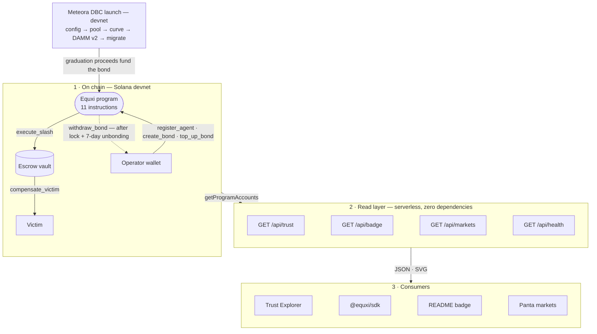

<p align="center">
  
</p>

<h1 align="center">Equxi</h1>

<p align="center"><strong>Slashable collateral for AI agents on Solana</strong></p>

<p align="center">
  <a href="https://equxi.sithunyein.com"></a>
  <a href="https://github.com/thesithunyein/equxi/actions"></a>
  <a href="https://explorer.solana.com/address/D7akK6aUVdYWfSwRDtuKFExZQkqtWZ1EFrRz1LQdfvhc?cluster=devnet"></a>
  <a href="TEST-RESULTS.md"></a>
</p>

<p align="center">
  <a href="https://equxi.sithunyein.com"></a>
</p>

---

## Use it

- **Check an agent:** [equxi.sithunyein.com/explorer.html](https://equxi.sithunyein.com/explorer.html). Search a name, an agent address or an owner wallet. No wallet connection, no account.
- **Read the registry:** `curl https://equxi.sithunyein.com/api/trust`
- **Embed a live grade:** `curl "https://equxi.sithunyein.com/api/badge?agent=<pda>"` returns an SVG that re-reads the chain on every request.

Every number is read from the program when you ask for it, including the parts that do not flatter this project.

## The Problem

Agents are being handed money. Nobody can check them.

Agents already hold wallets, cards and paid API access. None of it answers what happens when
they don't deliver:

- **The provider eats the loss.** An endpoint serving an unknown agent spends compute before
  settlement clears. If it never pays, there is no recourse.
- **Reputation that is free to lose is free to lie.** Burn a rating, register a new key,
  clean slate the same block.
- **Permission is solved; consequence isn't.** Wallets cap what an agent can spend. Nothing
  makes it *pay* when it breaks a rule anyway.

Platforms solved **permission**: allowlists, spend caps, approvals. Equxi is the missing
half: **consequence**.

Operators lock SOL as a bond for their agent. The program holds it in its own vault, and any
counterparty reads the bond and slash history from one endpoint before dealing.

### Who reads a bond

| Buyer | What they get |
|---|---|
| **API & MCP providers** | A way to price the risk of serving an unknown agent before spending compute on it |
| **Agent marketplaces** | Bonding as a listing requirement, which moves liability onto the operator |
| **Agent frameworks** | A trust module their wallet-holding agents can adopt instead of building compliance |

## How It Works

<p align="center">
  <strong>1. Register</strong> &nbsp;&rarr;&nbsp; <strong>2. Bond</strong> &nbsp;&rarr;&nbsp; <strong>3. Enforce</strong> &nbsp;&rarr;&nbsp; <strong>4. Slash</strong> &nbsp;&rarr;&nbsp; <strong>5. Compensate</strong>
</p>

<p align="center">
  <em>Create identity</em> &nbsp;&middot;&nbsp; <em>Lock SOL</em> &nbsp;&middot;&nbsp; <em>Set rules</em> &nbsp;&middot;&nbsp; <em>Penalize</em> &nbsp;&middot;&nbsp; <em>Pay victims</em>
</p>

## Deployed

| Component | Link |
|-----------|------|
| Landing page | [equxi.sithunyein.com](https://equxi.sithunyein.com) |
| Trust Explorer | [equxi.sithunyein.com/explorer.html](https://equxi.sithunyein.com/explorer.html) |
| Dashboard | [equxi.sithunyein.com/app.html](https://equxi.sithunyein.com/app.html) |
| Documentation | [equxi.sithunyein.com/docs.html](https://equxi.sithunyein.com/docs.html) |
| Launch (Meteora DBC) | [equxi.sithunyein.com/launch.html](https://equxi.sithunyein.com/launch.html) |
| Pitch deck | [equxi.sithunyein.com/deck.html](https://equxi.sithunyein.com/deck.html) |
| Read API | [`/api/trust`](https://equxi.sithunyein.com/api/trust) · [`/api/badge`](https://equxi.sithunyein.com/api/badge) · [`/api/markets`](https://equxi.sithunyein.com/api/markets) |
| SDK | [`@equxi/sdk` on npm](https://www.npmjs.com/package/@equxi/sdk) |
| Program | [`D7akK6aUVdYWfSwRDtuKFExZQkqtWZ1EFrRz1LQdfvhc`](https://explorer.solana.com/address/D7akK6aUVdYWfSwRDtuKFExZQkqtWZ1EFrRz1LQdfvhc?cluster=devnet) |
| Network | Solana Devnet |
| Repo | [github.com/thesithunyein/equxi](https://github.com/thesithunyein/equxi) |

## Start with the proof

Every claim here has a file behind it, and a counterparty, judge or auditor can check the
same set. Nothing needs to be taken on faith:

| Claim | Where it is checked |
|---|---|
| The program moves value, not just compiles | [`TEST-RESULTS.md`](TEST-RESULTS.md): the live devnet compensation run with balances asserted |
| An operator cannot exit before a late violation lands | [`withdraw_bond.rs`](programs/equxi/src/instructions/withdraw_bond.rs): the unbonding window, rehearsed live by [`prove-unbonding.js`](prove-unbonding.js) |
| The security posture is real, including its gaps | [`SECURITY-AUDIT.md`](SECURITY-AUDIT.md): five risk areas, the three repairs it produced, and the one deploy-gated patch |
| An auditor can start from a written scope, not an invitation | [`CERTIK-BRIEF.md`](CERTIK-BRIEF.md): scope, trust boundaries and a month-by-month roadmap |
| A token launch can fund its own collateral | [`meteora-launch/README.md`](meteora-launch/README.md): ten linked devnet transactions through DBC and DAMM v2, and the config published as a reusable [preset](meteora-launch/presets/safety-escrow.json) |
| Agent risk can be priced | [`panta-agent-market.js`](panta-agent-market.js) + [`api/markets.js`](api/markets.js): the Panta integration, live on the Explorer; test-key fixtures are labelled as fixtures, never presented as live markets |
| Reads are not tied to one provider | [`api/trust.js`](api/trust.js): `EQUXI_RPC` selects the RPC endpoint; `?rpc=` still wins |

## Meteora DBC — a launch that funds its own collateral

<p align="center">
  <a href="https://equxi.sithunyein.com/launch.html"></a>
</p>

A token launch on Meteora's dynamic bonding curve, configured so the share of the
graduation proceeds a creator is entitled to is not spent but **posted as an Equxi agent's
slashable bond** — the same transaction trail that creates the token creates the
consequence for the agent that runs it. Ten transactions, each linked on
[`launch.html`](https://equxi.sithunyein.com/launch.html), and the config published as a
reusable [preset](meteora-launch/presets/safety-escrow.json) a builder can validate and
reuse.

The honest limits, stated where the track judges them: it ran on **devnet**, and the launch
contributed **0.0698 SOL** of the 0.1 SOL bond — the script tops up the remainder, which a
larger curve removes. [`meteora-launch/README.md`](meteora-launch/README.md) gives the full
account.

## On-Chain Proof

The program's eleven instructions are live on devnet. All transactions confirmed.

| Instruction | Description |
|-------------|-------------|
| `initialize` | Creates config + escrow vault; admin is bound to the program upgrade authority |
| `create_vault` | One-time migration: creates the escrow vault on an older config (upgrade authority + admin) |
| `register_agent` | Creates agent identity with name, type, and trust score |
| `create_bond` | Locks SOL as collateral; the agent owner must sign |
| `top_up_bond` | Records collateral added after creation; operator-only, updates `bond.amount` |
| `withdraw_bond` | Returns and closes the bond after the lock period **and a 7-day unbonding window** |
| `add_constraint` | Adds a behavioral rule; agents may hold many |
| `execute_slash` | Seizes collateral into the program-owned escrow vault |
| `compensate_victim` | Pays the victim out of the escrow vault |
| `update_trust_score` | Updates agent reputation |
| `migrate_agent` | Grows a v0.1 agent account in place, preserving every existing field |

## Quick Start

### Prerequisites

| You want to | You need |
|-------------|----------|
| Run the site and the read API | Node 18+ and nothing else — `api/` and `lib/` have **zero dependencies** |
| Run the validator-free tests | Node 18+, then `npm install` |
| Build or deploy the program | Solana CLI 2.1+, Rust stable, Anchor **0.31.2** |
| Run the Panta flows | a free `pk_test_` key from [Panta](https://panta.market) — optional |

### Environment

Every variable is optional, and each one states its own absence in the response rather
than failing quietly.

| Variable | When set | When unset |
|----------|----------|------------|
| `PANTA_API_KEY` | `/api/markets` reads live data (`pk_live_…`) or sandbox fixtures (`pk_test_…`, labelled as such) | the endpoint answers **200** with `configured: false` and a note — never a fake-empty list, never a 500 that reads as an outage |
| `EQUXI_RPC` | every read defaults to that endpoint | the public cluster node, `api.devnet.solana.com` |
| `EQUXI_RPC_FALLBACKS` | comma-separated hosts tried when the primary fails | no fallback host |
| `EQUXI_LOG` | `1` forces one structured JSON line per request, `0` silences it | on when running on Vercel, off locally |

### Run the site and the read API

```bash
git clone https://github.com/thesithunyein/equxi.git
cd equxi

# Serves the site AND the api/ functions locally (no Vercel CLI, no build step).
node dev-server.js

#   Landing      http://localhost:4321/
#   Dashboard    http://localhost:4321/app.html
#   Explorer     http://localhost:4321/explorer.html
#   Read API     http://localhost:4321/api/trust
#   Badge        http://localhost:4321/api/badge?agent=<pda>
#   Markets      http://localhost:4321/api/markets
#   Health       http://localhost:4321/api/health
```

Plain `npx serve .` also works for the landing page and the dashboard, but the Trust
Explorer and the badge need `/api/trust` and `/api/badge`, which `dev-server.js` provides
and a static server does not.

To check any deployment's read path in one call:

```bash
curl https://equxi.sithunyein.com/api/health
```

It answers with the cluster, the program, **which build is serving you** (`commit`), whether
the upstream node is reachable and at what latency, and whether the Panta feed is live or
sandbox. It never contains a key.

### Program

```bash
# Prerequisites: Solana CLI v2.1+, Rust stable
git clone https://github.com/thesithunyein/equxi.git
cd equxi
cargo build-sbf
solana program deploy target/deploy/equxi.so
```

### Upgrading a live deployment

Shipping new program code is only half an upgrade, and the other half is the
part that bites. v0.2 added `constraint_count` to `Agent`, growing that account
from 116 to 118 bytes. Anchor refuses to deserialize a shorter account, so once
the new code is deployed the program cannot read its own pre-existing agents,
and nothing looks wrong from outside, because the website decodes accounts
directly and keeps working.

```bash
node migrate.js --dry-run   # report what would change; sends nothing
bash deploy-v2.sh           # upgrade, migrate, create the vault, verify
```

`deploy-v2.sh` refuses to start unless three things hold: the on-chain program
still matches the v0.1 build kept for rollback, the artifact declares *this*
deployment's program id (an `anchor build` run after `anchor keys sync`
produces one that would deploy cleanly and then reject every instruction), and
the authority holds the rent the upgrade buffer needs.

`migrate.js` creates the escrow vault that v0.1 never had, grows every agent
still on the v0.1 layout, and then re-decodes each account to prove that owner,
name, score, status, bond address and `created_at` are byte-for-byte unchanged.
A migration that quietly rewrote a reputation record would be worse than no
migration at all, so it checks rather than assumes.

### Tests

Everything CI runs, in the order it runs it:

```bash
npm install

# 1. The fast gate: wire formats, PDA seeds, IDL, SDK, read layer, read API,
#    Panta routes and page copy. No validator, no Solana toolchain, no network.
npm run test:unit
#   → 206 passing in ~9s

# 2. Typecheck everything the tests touch.
npx tsc --noEmit
#   → no output, exit 0

# 3. Rust unit tests inside the program crate (no validator needed).
cargo test --manifest-path programs/equxi/Cargo.toml --features no-entrypoint

# 4. The full program suite against a local validator (Anchor + Solana CLI required).
anchor test --skip-build
#   → 181 passing

# 5. The SDK and the plugin typecheck, each with their own tsconfig.
cd sdk && npm install && npx tsc --noEmit && cd ..
cd eliza-plugin && npm install && npx tsc --noEmit && cd ..
```

CI runs all five on every push, plus a **structure job** that pins the files, the routes and
the `vercel.json` header shape. A renamed module, a missing route, or an illegal key in the
Vercel config fails the build instead of the deployment — which is exactly how a silent
production freeze was caught and made impossible to repeat.

`tests/unit/` is the contract for the account layouts in `SPEC.md`. It builds
account buffers by hand, decodes them with the hand-written decoders, the read
API's decoders, and Anchor's own coder, and asserts all of them agree, so a
layout change that is not mirrored in every client fails immediately.

| File | What it pins |
|------|--------------|
| `tests/unit/layout.test.ts` | Discriminators, PDAs, Borsh encoding |
| `tests/unit/sdk.test.ts` | The IDL shipped in `sdk/src/idl/equxi.json` |
| `tests/unit/read.test.ts` | Query filters, decoding, the trust-scoring rules, and that the SDK scorer and the API scorer agree |
| `tests/unit/api.test.ts` | `api/trust.js`, `api/badge.js` and `api/markets.js` end to end, against stubbed RPC and Panta responses |
| `tests/unit/panta.test.ts` | The Panta routes, bodies and headers for the create, buy and attribute flows, plus the agent-market plan constraints |
| `tests/unit/copy.test.ts` | Page copy limits, cross-page links, and one word per idea (a slash is a slash) |
| `tests/unit/landing.test.ts` | The landing page's live stats: placeholders, error copy, and the textContent-only rule |

> **Honest status:** the unit tests and all TypeScript typechecks pass, CI
> compiles the Rust program and runs `anchor test` on a local validator, and the
> 116 → 118 byte agent migration has its own Rust unit tests. **Devnet runs the
> unbonding-window build as of 2026-10-04** (upgrade `5tK2dMyR…`, on-chain bytes
> verified against the CI artifact), with the live agents migrated in place (all
> 8 preserved fields verified byte-identical) and the escrow vault created;
> transactions in [`TEST-RESULTS.md`](TEST-RESULTS.md).

## Architecture

One bond, from an operator's wallet to the person deciding whether to trust an agent. Three
layers, and the only thing they share is the program's account layout.



The contract between layer 1 and layer 2 is the account layout, and it is written down twice
on purpose: as Rust structs the program serialises, and as decoders in
[`lib/equxi-layout.js`](lib/equxi-layout.js). `tests/unit/layout.test.ts` decodes the same
buffer with both, plus Anchor's own coder, and asserts all three agree — so a layout change
that is not mirrored everywhere fails in CI instead of in production.

### The tree, with real line counts

Measured from the working tree; comments and blank lines included.

```
equxi/
├── programs/equxi/src/            1,398 · 15 files   Rust program (Anchor 0.31.2)
│   ├── lib.rs                       104   instruction surface
│   ├── state.rs                     132   Config, Agent, Constraint, Bond, SlashRecord
│   ├── error.rs                      44   error codes
│   └── instructions/              1,118 · 12 files   11 handlers + mod
│       └── largest: migrate_agent.rs 231 · withdraw_bond.rs 159 · top_up_bond.rs 130
├── tests/equxi.test.ts              664   Anchor suite against a local validator (17 cases)
├── tests/unit/                    4,217 · 8 files   validator-free, ~9s, no network
│   ├── api.test.ts                1,785   trust, badge, markets, health — stubbed RPC + Panta
│   ├── read.test.ts                 663   query filters, decoding, scoring
│   ├── sdk.test.ts                  585   the IDL as shipped
│   ├── layout.test.ts               483   discriminators, PDAs, Borsh
│   ├── copy.test.ts                 206   page copy, cross-page links, one word per idea
│   ├── panta.test.ts                193   Panta routes, bodies, headers
│   ├── landing.test.ts              170   live landing stats
│   └── meteora-preset.test.ts       132   the DBC preset, pinned to its launch
├── api/                           2,071 · 8 files   read API (no dependencies)
│   ├── trust.js                     723   GET /api/trust — agent, bond, slash history
│   ├── markets.js                   410   GET /api/markets — list · market · positions
│   ├── badge.js                     302   GET /api/badge — embeddable SVG grade
│   └── health.js                    134   GET /api/health — is the read path up, which build
├── lib/                           1,416 · 8 files   shared, dependency-free
│   ├── equxi-layout.js              623   account layouts + scoring (the cross-layer contract)
│   ├── panta.js                     212   Panta create · buy · attribute
│   ├── log.js                        93   one structured line per request
│   └── rate-limit.js                 81   per-instance throttle
├── sdk/src/                       1,924 · 4 files   @equxi/sdk on npm
├── eliza-plugin/src/              1,336 · 7 files   elizaOS plugin (IDL-free)
├── meteora-launch/                2,286 · 10 files   the DBC launch, on devnet
│   ├── launch-safety-bond.js        611   config → pool → curve → migrate → bond
│   ├── presets/index.js             241   dependency-free preset loader + validator
│   └── presets/safety-escrow.json    89   the config, published as data
├── site                           5,180             6 pages, 3 scripts, no framework
│   ├── explorer.html / explorer.js  489 / 1,335   Trust Explorer
│   ├── app.html / app.js            223 / 1,085   operator dashboard
│   ├── deck.html                    640   the pitch, as a page
│   ├── docs.html                    632   documentation
│   ├── index.html / landing.js      333 / 135
│   └── launch.html / launch.js      308 / 189
├── theme.css / app.css / styles.css 628 / 440 / 311
├── dev-server.js                    115   site + api/ locally, no build step
├── migrate.js                       340   v0.1 → v0.2 in place, then re-decoded to prove it
├── prove-compensation.js            306   13/13 assertions against live devnet
├── prove-unbonding.js               197   7/7 assertions against live devnet
├── panta-agent-market.js            355   create and trade the agent-risk market
├── SPEC.md                          225   Agent Accountability Standard (AAS-1)
├── SECURITY-AUDIT.md                258   five risk areas and the repairs they produced
├── TEST-RESULTS.md                  641   what ran, on which network, with what output
└── vercel.json · tsconfig.json · Anchor.toml · Cargo.toml · package.json
```

## On-Chain Accounts

```rust
struct Config {
    admin: Pubkey,           // Slash/compensate authority (= program upgrade authority)
    total_agents: u64,
    total_bonds: u64,
    total_slashed: u64,      // also the slash-record nonce source
}

struct Vault {               // Program-owned escrow for slashed collateral
    total_slashed: u64,
    total_compensated: u64,
}

struct Agent {
    owner: Pubkey,           // Operator wallet, must sign to create a bond
    name: [u8; 32],
    agent_type: AgentType,   // Trader, Oracle, DeFi, etc.
    trust_score: u8,         // 0-100 reputation
    status: AgentStatus,     // Active, Slashed, Deactivated
    bond_address: Pubkey,
    constraint_count: u16,   // next constraint PDA index
    created_at: i64,
}

struct Bond {
    agent: Pubkey,
    operator: Pubkey,        // always the agent owner
    amount: u64,             // collateral still held (excludes rent)
    lock_duration: i64,
    locked_at: i64,
    expires_at: i64,
    is_active: bool,
}

struct Constraint {
    agent: Pubkey,
    constraint_type: ConstraintType,  // SpendLimit, ProgramAllowlist, Timelock, Velocity
    params: ConstraintParams,
    is_enforced: bool,
    created_at: i64,
}

struct SlashRecord {
    agent: Pubkey,
    authority: Pubkey,
    amount: u64,
    reason: [u8; 128],
    nonce: u64,
    timestamp: i64,
    victim: Option<Pubkey>,
    compensated: bool,
}
```

## Security Model

Equxi is **non-custodial with respect to slashed funds**:

- **Slashed collateral is escrowed, never taken.** `execute_slash` moves lamports
  from the bond into a program-owned `vault` PDA. The admin never receives them.
- **Compensation is paid from escrow.** `compensate_victim` transfers from the vault
  to the victim and does **not** touch `bond.amount`, so a bond's recorded collateral
  always matches the lamports it actually holds. The vault maintains
  `lamports == rent_exempt_min + (total_slashed - total_compensated)`.
- **Withdrawal closes the bond.** `close = operator` returns rent plus remaining
  collateral, so nothing is stranded in an unreachable account.
- **Only the owner can bond.** `create_bond` requires the agent owner's signature,
  so a third party cannot squat an agent's bond PDA.
- **The admin is the upgrade authority.** `initialize` takes no admin argument and
  verifies the signer against the program's `ProgramData` upgrade authority.
- **Compensation is bounded.** A payout cannot exceed its slash amount, a slash can
  only be compensated once, and payouts cannot exceed the vault balance.

> **Scope note.** Equxi does not yet *prevent* violations on chain: detection is
> off-chain and a slash is asserted by the configured authority. The protocol
> guarantees that once a violation is recorded, the money moves correctly. On-chain
> violation proofs, dispute windows, and decentralized slashing are tracked as open
> problems in [`SPEC.md`](SPEC.md).

## Read API

The question a counterparty actually asks is not "how does the program work" but
*does this agent have collateral at risk, and has it ever been slashed?*
`GET /api/trust` answers it as JSON. It is a single dependency-free Vercel
function ([`api/trust.js`](api/trust.js)) over
[`lib/equxi-layout.js`](lib/equxi-layout.js).

```bash
# Every agent, with bond and slash history joined
curl https://equxi.sithunyein.com/api/trust

# One agent by its PDA address
curl "https://equxi.sithunyein.com/api/trust?agent=<pda>"

# Every agent owned by a wallet
curl "https://equxi.sithunyein.com/api/trust?owner=<wallet>"
```

A named `agent=` that holds no account answers **`404`** with
`code: "AGENT_NOT_FOUND"` and `x-equxi-status: unknown`, so a caller asking about
one address can tell *not found* from *found, with nothing at stake*. A named
`owner=` with no agents is a **`200`**: the address exists, it simply holds none.
(The embeddable badge keeps its own rule — a grey `not found` at `200` — because
it is an image in someone's README, where a `404` renders as nothing at all.)

**A node that refuses is not a dead page.** The last complete registry read is
remembered for a few minutes, and if the node then refuses — the public devnet
endpoint rate-limits the shared egress address a burst of `getProgramAccounts`
comes from — that read is answered from the remembered copy with `stale: true`,
`snapshotAgeSeconds`, and a `warnings` entry naming the upstream failure. A
targeted read is answered from it **only** when the snapshot holds that address:
an agent the snapshot never saw stays an error, never a `404`, because a read
from minutes ago cannot tell “does not exist” from “registered since”. The badge
always asks for a live read and refuses the snapshot outright, because what it
advertises is a fresh grade.

A deployment can set `EQUXI_RPC` to make every read default to a dedicated
endpoint (for example RPC Fast's Focus plan); an explicit `?rpc=` still wins.

```jsonc
{
  "ok": true,
  "cluster": "devnet",
  "warnings": [],
  "counts": { "agents": 12, "bonds": 9, "slashes": 3, "constraints": 21 },
  "totals": { "slashCount": 3, "openSlashes": 1, "bondedLamports": "…", "bondedSol": 41.5 },
  "vault": { "totalSlashedLamports": "…", "availableLamports": "…" },
  "agents": [
    {
      "address": "…", "name": "augur", "owner": "…", "status": "active", "layout": "v2",
      "profile": {
        "grade": "B", "score": 80, "onChainTrustScore": 50,
        "breakdown": [
          { "label": "Base score", "points": 100 },
          { "label": "1 slash recorded (10 each)", "points": -10 },
          { "label": "1 slash not yet compensated (12 each)", "points": -12 }
        ],
        "bond": { "amountSol": 3, "locked": true, "expired": false },
        "slashes": [{ "reason": "exceeded spend limit", "compensated": false }],
        "stats": { "slashCount": 1, "openSlashes": 1, "uncompensatedLamports": "…" },
        "warnings": ["On-chain trust_score is 50; the derived score is 80. …"]
      }
    }
  ]
}
```

**The score is derived, not read.** `grade` and `score` come only from
observable on-chain evidence: whether a bond is posted, how large it is, and
whether each recorded violation was actually compensated. The on-chain
`trust_score` field is admin-set, so it is reported separately and never used as
an input. An agent with no bond is `ungraded`, not trustworthy.

**The score is auditable, not asserted.** `profile.breakdown` is the ledger that
produced the score: a `+100` base entry followed by one negative entry per
deduction, summing exactly to `score` (including the floor, which is recorded as
its own entry so the arithmetic still closes). A counterparty can therefore check
the number instead of trusting it, and `tests/unit/read.test.ts` pins the
invariant.

**Reads are cached at the edge, deliberately.** A registry read is a
whole-program scan, so the policy is declared per route in
[`vercel.json`](vercel.json): `s-maxage=30, stale-while-revalidate=300` for
`/api/trust` and `/api/markets`, `s-maxage=30` for `/api/badge`, and `no-store`
for `/api/health`. Numbers can therefore trail the chain by up to half a minute,
which is why every payload carries `generatedAt` instead of implying it is live
to the slot. That reasoning sits here rather than beside the rules because
`vercel.json` takes no comments and the platform's schema rejects unknown keys —
`npx`-free CI now asserts the file's shape, since a rejected config fails the
whole deployment and leaves production on the previous commit with every other
check still green.

## Is the read path up?

Every page on this site draws its numbers from one upstream RPC, and when that
node is slow the pages still render — stale or empty, with nothing saying so.
`GET /api/health` is that "so": one cheap `getSlot`, answered `200` with the
slot and the round-trip time, or `503` with the reason. The upstream is reported
as its **host only**, so a paid provider's key never leaves in a response body.

```bash
curl https://equxi.sithunyein.com/api/health
# {"ok":true,"cluster":"devnet","upstream":{"host":"api.devnet.solana.com",
#  "reachable":true,"slot":508100000,"latencyMs":141},
#  "feeds":{"panta":{"configured":true,"sandbox":false}}}
```

It also states which Panta feed the deployment is wired to. A `pk_test_` key
answers with sandbox fixtures, which a reader of `/api/markets` should not have
to infer from a disclaimer, so `feeds.panta.sandbox` names it. This is
informational and never changes the status code: an unconfigured or sandbox feed
is a deliberate configuration, not an outage.

## Embeddable trust badge

The registry is only useful where agents are already shown, so any agent can wear
its own grade:

```bash
curl "https://equxi.sithunyein.com/api/badge?agent=<pda>"                 # SVG
curl "https://equxi.sithunyein.com/api/badge?agent=<pda>&format=json"    # numbers
```

```markdown
[](https://equxi.sithunyein.com/explorer.html?agent=<pda>)
```

The badge re-reads the chain on **every** request, so it cannot silently go
stale, and it refuses to flatter: an address with no agent account renders grey
`not found`, not green, and `x-equxi-status: unknown` says so in the headers. It
is a live view, not a certificate. Agent names and slash reasons are
attacker-controlled, so everything is XML-escaped before it reaches the markup.

**Which layout it read is part of the response.** Devnet runs v0.2, whose
`Agent` accounts are 118 bytes and whose slashed collateral is held in an escrow
`vault`, but the reader still understands the 116-byte v0.1 layout, because a
pre-migration agent on any deployment must stay readable. The decoder selects the
layout from the account length and reports `layout: "v1" | "v2"`, adding a
program-level `warnings` entry when a deployment is v0.1, so a reader can see
whether the numbers are partial instead of assuming they are complete.

`api/trust.js` is the only JavaScript that restates the account layouts besides
the TypeScript clients, and the duplication is deliberate: the site is static and
`vercel.json` sets `"buildCommand": null`, so there is nowhere to run generated
code. What keeps the copy honest is
[`tests/unit/api.test.ts`](tests/unit/api.test.ts), which pins every
discriminator, size, and decoded field against the independently written decoder
in `eliza-plugin/src/coder.ts`.

## Panta markets feed

Equxi tells you whether an agent's collateral is at risk; the markets an agent
trades are the other half of the picture. `GET /api/markets` reads live from
[Panta's](https://panta.market) API and normalizes the answer into one flat
shape. It never custodies or signs anything.

The endpoint answers three documented Panta reads, chosen by query:

| Query | Panta route | Answers |
|-------|-------------|---------|
| *(none)* | `GET /markets/` | The catalog list, with cursor paging |
| `?market=<marketId>` | `GET /markets/{marketId}/` | One market, with the spot `yesPrice` / `noPrice` the list leaves `null` |
| `?wallet=<pubkey>` | `GET /positions/?wallet=` | That wallet's holdings: `side`, `shares`, `claimable`, `claimed`, `outcome` |

The last two are the pair Panta's own documentation tells you to combine:
positions carry share quantity and claim eligibility, the market detail carries
the price used to value them (`shares × side price`). Serving both means a
reader can price a holding without a wallet, an SDK, or a Panta account.

**Powered by Panta**: the attribution Panta's Terms of Use require wherever
Panta-powered functionality appears. It is carried in the JSON payload
(`attribution`) and rendered on the Explorer's markets card.

```bash
# The feed itself (200 even when the integration is switched off; see below)
curl https://equxi.sithunyein.com/api/markets

# Filtered, with Panta's cursor pagination forwarded
curl "https://equxi.sithunyein.com/api/markets?category=sports&status=open&createdBy=me&limit=50"

# One market, with the spot prices the list route omits
curl "https://equxi.sithunyein.com/api/markets?market=<marketId>"

# A wallet's positions, with claim eligibility
curl "https://equxi.sithunyein.com/api/markets?wallet=<pubkey>"
```

With a `pk_test_` key — the sandbox shape the fixture below comes from:

```jsonc
{
  "ok": true,
  "configured": true,
  "sandbox": true,
  "source": "panta",
  "attribution": "Powered by Panta",
  "generatedAt": 1800000000,
  "disclaimer": "Test mode: this response uses sandbox fixtures and does not access Solana mainnet.",
  "counts": { "markets": 1 },
  "nextCursor": null,
  "markets": [ { "marketId": "TestMarket1111…", "title": "Sandbox test market", "phase": "primary", "volumeUsdc": "0.00" } ]
}
```

The endpoint is honest about being switched off: with **no `PANTA_API_KEY` set**
it answers `200` with `configured: false` and a `note` saying what to set:
never a 500 that reads like an outage, and never a made-up empty market list
that reads like data. Upstream failures keep their meaning: `RATE_LIMITED`
becomes a `429`, `INVALID_MARKET_PARAMS` a `400`, and a rejected key a `502`
because that is this deployment's config fault, not the caller's.

**Agent-risk markets.** Discovery is half the integration; the other half is
creation and trading, in [`panta-agent-market.js`](panta-agent-market.js) over
[`lib/panta.js`](lib/panta.js):

```bash
# Validate auth + params + fee without paying anything
PANTA_API_KEY=pk_test_… node panta-agent-market.js create \
  --agent <agentPDA> --name "Witness260521" --resolve-by 2026-11-15 --dry-run

# Create: quote → build → sign → broadcast → register
PANTA_API_KEY=pk_test_… node panta-agent-market.js create \
  --agent <agentPDA> --name "Witness260521" --resolve-by 2026-11-15 --key <keypair.json>

# Trade YES, then report the trade for attribution
PANTA_API_KEY=pk_test_… node panta-agent-market.js buy \
  --market <marketId> --side yes --amount 20.00 --key <keypair.json>
```

**Test keys are a sandbox. Verified with a real key on 2026-10-05, not inferred.**
A `pk_test_` key is free to mint, and Panta answers it with fixtures: the create
quote returns `cr_sandbox_test` / `TestMarket1111…`, the build returns a
zero-length transaction with `recentBlockhash: SandboxBlockhash…`, and every
response says *“Test mode: this response uses sandbox fixtures and does not
access Solana mainnet.”* The CLI detects that and stops with exactly that
explanation instead of trying to sign a fixture. A real, tradable market needs a
`pk_live_` key and ~50 USDC (40 platform + 10 liquidity) on a funded mainnet
wallet.

**The live deployment reads Panta with a `pk_live_` key** (as of 2026-10-06).
`/api/markets` answers `configured: true` with `sandbox: false` and real markets
— the Explorer's markets card reads 50 of them — and `feeds.panta` in
`/api/health` names the mode, so whether the feed is real or fixtures is a fact
a reader can check rather than a claim in this file. Switching back to a
`pk_test_` key does not need a code change: the same endpoints answer
`sandbox: true` with the labelled fixture, which is the shape shown above. Each
agent's panel also carries a "Market on this agent" section that matches markets
by agent name or address, so it fills in the day a real market names an agent;
until then it says so.

The question is mechanical and public: *“Will Equxi agent <name> be slashed
before <date>?”* It resolves from the same `/api/trust?agent=` evidence
anyone can curl, so the market prices the exact risk this repo exists to make
legible. Nothing is ever custodied: Panta cooks the transaction, the local
wallet signs it, we broadcast on our RPC, then report the signature back.

## Trust Explorer

[`explorer.html`](explorer.html) is the human-readable view of the same data:
the page you can hand to someone who will not run `curl`. It is read-only, needs
no wallet connection, and explains itself on the page rather than in a repo
folder. It answers the question a counterparty has, not the one a developer has:

* **Search the way people know an agent** by name, agent address or owner wallet.
  A pubkey is tried as an agent account first and then as an owner, so the reader
  does not have to know which they pasted.
* **Open a row, not a new page.** A click or `Enter` expands that agent's panel
  inline: collateral and its lock state, slash history, the score ledger, the
  market section and the badge snippets.
* **Sort and filter the registry** by collateral, weakest score, slash count or
  age, and narrow by grade or to agents with unpaid slashes. The same layout
  becomes one card per agent on a phone.
* **Audit the grade.** Each panel renders the score ledger
  (`profile.breakdown`) so the deduction behind every point is visible, next to
  the on-chain `trust_score` it deliberately ignores.
* **See the market, when one exists.** The page renders the Panta feed with a
  `Sandbox fixtures` label when the deployment holds a test key, and each panel
  lists the markets that name that agent; when none do, it says so instead of
  showing someone else's market.
* **Count rules the honest way.** Rules are read from the Constraint accounts
  themselves, and a pre-migration agent gets a note that the on-chain counter
  does not exist on its layout, so the count is never a confident `0` that
  contradicts the rules listed beside it.
* **Embed it.** Every agent panel generates the Markdown, HTML and JSON URLs for
  that agent's live badge.

Deep links work for all three lookups: `?agent=<pda>`, `?owner=<wallet>` and
`?q=<name>`. A failed lookup is reported as a failure: the page never presents an
RPC error as “no agents found”.

## SDK

The Anchor IDL lives at [`sdk/src/idl/equxi.json`](sdk/src/idl/equxi.json) and is
loaded by `EquxiClient`. It is checked in because the SDK must install and work
without an `anchor build` step. `anchor build` regenerates an equivalent file at
`target/idl/equxi.json`; copy that over to refresh it. `tests/unit/sdk.test.ts`
fails if the IDL drifts from the code.

```typescript
import { EquxiClient } from "./sdk/src";

const client = new EquxiClient(provider);

// One-time. Must be signed by the program's upgrade authority.
await client.initialize();

// Register agent
const { agentPDA } = await client.registerAgent("AlphaTrader", { trader: {} });

// Lock 5 SOL for 30 days. The agent owner signs.
const { bondPDA } = await client.createBond(
  agentPDA, new BN(5_000_000_000), new BN(2_592_000)
);

// Add a spending limit (max 1 SOL per day). Agents may hold many rules.
await client.addConstraint(agentPDA, { spendLimit: {} }, {
  maxAmount: new BN(1_000_000_000),
  maxPerPeriod: new BN(5_000_000_000),
  periodSeconds: new BN(86400),
  timelockSeconds: new BN(0),
  allowedPrograms: Array(8).fill(SystemProgram.programId),
});

// A violation is recorded: seize collateral into escrow
const { slashPDA } = await client.executeSlash(
  agentPDA, "Exceeded spending limit", new BN(100_000_000)
);

// Pay the injured party out of escrow
await client.compensateVictim(agentPDA, new BN(0), victimPubkey, new BN(100_000_000));

// Anyone can audit the escrow
const vault = await client.getVault();
console.log("Available to victims:", vault.available.toString());
```

## Usage in elizaOS

**pnpm, straight from git:**

```bash
pnpm add github:thesithunyein/equxi#path:eliza-plugin
```

**npm / yarn:** clone and install by path (npm's git installer cannot target a subdirectory):

```bash
git clone https://github.com/thesithunyein/equxi.git
# then in your package.json:
#   "dependencies": { "@equxi/plugin-eliza": "file:../equxi/eliza-plugin" }
```

Live on npm as [`@equxi/plugin-eliza`](https://www.npmjs.com/package/@equxi/plugin-eliza): `npm install @equxi/plugin-eliza`.

```typescript
import { equxiPlugin } from "@equxi/plugin-eliza";

const agent = {
  plugins: [equxiPlugin],
  settings: {
    WALLET_PUBLIC_KEY: "your-solana-wallet-public-key",
    SOLANA_RPC_URL: "https://api.devnet.solana.com",
  },
};
```

Then talk to your agent naturally:

| What you say | Action triggered |
|---|---|
| `"Register my bot as an agent"` | `EQUXI_REGISTER_AGENT` |
| `"Lock 0.5 SOL as bond"` | `EQUXI_LOCK_BOND` |
| `"Set 1 SOL daily spend limit"` | `EQUXI_ADD_CONSTRAINT` |
| `"Slash 0.1 SOL for exceeding limit"` | `EQUXI_SLASH_BOND` |

See [`eliza-plugin/README.md`](eliza-plugin/README.md) for full docs.

## Status

Live on devnet and readable by anyone. No external operators yet, and slashing
is authority-signed today: on-chain violation proofs, dispute windows and
decentralized slashing are the next roadmap items in [`SPEC.md`](SPEC.md).
Everything above is checked by a test or by a real transaction.

## Grant

Equxi is a recipient of Superteam's [Agentic Engineering Grant](https://superteam.fun/earn/grants/agentic-engineering), awarded August 28, 2026.

---

Built by [Sithu Nyein](https://sithunyein.com)
